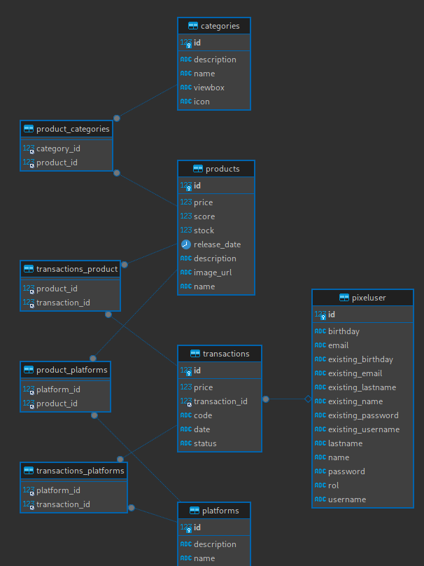

# Pixel-Palace-MsMarketTransactions

# **Introducción**

Pixel Palace es tu destino para explorar y adquirir una amplia variedad de videojuegos de distintas plataformas. Nuestra API proporciona un conjunto completo de funcionalidades que te permitirán gestionar tu catálogo de productos, realizar transacciones y obtener información valiosa sobre los juegos más populares y mejor valorados.

## **Características Destacadas**

- **Gestión de Productos:**
    - Agrega, edita, elimina y obtén detalles de productos (juegos) en nuestro mercado.
    - Explora nuestra extensa colección que abarca categorías, plataformas y géneros diversos.
- **Transacciones:**
    - Realiza compras seguras y consulta el historial de transacciones.
    - Obtén detalles específicos de cada transacción, incluyendo productos adquiridos y precios.
- **Generación de Informes:**
    - Accede a informes detallados sobre los juegos más vendidos y mejor puntuados.
    - Personaliza los informes según tus preferencias, filtrando por fechas, categorías y plataformas.

## **Cómo Empezar**

1. **Registro y Autenticación:**
    - Regístrate en Pixel Palace para obtener tus credenciales de API.
    - Autentica tus solicitudes para acceder a funciones seguras.
2. **Gestión de Productos:**
    - Añade nuevos juegos a tu catálogo utilizando la API.
    - Modifica detalles existentes o elimina productos según sea necesario.
3. **Realización de Compras:**
    - Explora la amplia selección de juegos disponibles.
    - Realiza compras seguras y revisa tu historial de transacciones.
4. **Informes Personalizados:**
    - Utiliza la API para generar informes detallados sobre las tendencias de ventas y las clasificaciones de los juegos.

# **Base de Datos**

## **Motor de Base de Datos**

Pixel Palace utiliza MySQL como su sistema de gestión de bases de datos relacional.

## **Esquema de Base de Datos**

La estructura de la base de datos se compone de varias tablas que interactúan para respaldar las funcionalidades del mercado de videojuegos. A continuación, se presentan las principales tablas y su propósito:

1. **categories:**
    - Almacena información sobre las categorías de productos.
2. **pixeluser:**
    - Contiene detalles de los usuarios registrados en Pixel Palace, incluyendo información personal y transaccional.
3. **platforms:**
    - Guarda información relacionada con las plataformas de juegos disponibles.
4. **products:**
    - Almacena detalles de los productos (juegos) disponibles en el mercado, incluyendo su nombre, descripción, precio y otras características.
5. **transactions:**
    - Registra las transacciones realizadas por los usuarios, incluyendo detalles sobre los productos comprados, precios y estados de transacción.

## **Conexión a la Base de Datos**

Para conectarse a la base de datos MySQL desde la aplicación, se utiliza la configuración estándar de Spring Boot, especificando la URL de la base de datos, el nombre de usuario y la contraseña en el archivo **`application.properties`**.

```

# Configuración de la Base de Datos MySQL
spring.datasource.url=jdbc:mysql://localhost:3306/pixel_palace
spring.datasource.username= ${username}
spring.datasource.password= ${password}
spring.datasource.driver-class-name=com.mysql.cj.jdbc.Driver

```

## **Diagrama Relacional**



# Modelos:

## 1**. Category**

Representa una categoría de productos en el mercado.

- **Atributos:**
    - **`id`**: Identificador único de la categoría.
    - **`name`**: Nombre de la categoría.
    - **`description`**: Descripción de la categoría.
    - **`viewbox`**: Vista previa de la categoría.
    - **`icon`**: Icono de la categoría.
    - **`products`**: Lista de productos asociados a la categoría.

## **2. PixelUser**

Representa un usuario en la plataforma.

- **Atributos:**
    - **`id`**: Identificador único del usuario.
    - **`name`**: Nombre del usuario.
    - **`lastname`**: Apellido del usuario.
    - **`username`**: Nombre de usuario.
    - **`password`**: Contraseña del usuario.
    - **`email`**: Correo electrónico del usuario.
    - **`rol`**: Rol del usuario.
    - **`birthday`**: Fecha de nacimiento del usuario.
    - **`transactions`**: Lista de transacciones asociadas al usuario.

## **3. Platform**

Representa una plataforma de juegos en el mercado.

- **Atributos:**
    - **`id`**: Identificador único de la plataforma.
    - **`name`**: Nombre de la plataforma.
    - **`description`**: Descripción de la plataforma.
    - **`products`**: Lista de productos asociados a la plataforma.
    - **`transactions`**: Lista de transacciones asociadas a la plataforma.

## **4. Product**

Representa un juego en el mercado.

- **Atributos:**
    - **`id`**: Identificador único del juego.
    - **`name`**: Nombre del juego.
    - **`description`**: Descripción del juego.
    - **`categories`**: Lista de categorías asociadas al juego.
    - **`platforms`**: Lista de plataformas asociadas al juego.
    - **`price`**: Precio del juego.
    - **`score`**: Puntuación del juego.
    - **`imageUrl`**: Lista de URLs de imágenes del juego.
    - **`stock`**: Stock disponible del juego.
    - **`releaseDate`**: Fecha de lanzamiento del juego.
    - **`transactions`**: Lista de transacciones asociadas al juego.

## **5. Transaction**

Representa una transacción en el mercado.

- **Atributos:**
    - **`id`**: Identificador único de la transacción.
    - **`status`**: Estado de la transacción.
    - **`code`**: Código de la transacción.
    - **`iduser`**: Usuario asociado a la transacción.
    - **`products`**: Lista de productos asociados a la transacción.
    - **`platform`**: Lista de plataformas asociadas a la transacción.
    - **`date`**: Fecha de la transacción.
    - **`price`**: Precio total de la transacción.

# Endpoints:

## **1. CategoryController**

### **`GET /api/v1/category/all`**

Obtiene la lista de todas las categorías.

## **2. PixelUserController**

### **`GET /user/{id}`**

**Descripción:** Obtiene la información de un usuario por su ID.

- **Parámetros:**
    - **`id`** (Path Variable): Identificador único del usuario.

### **`GET /user/list`**

**Descripción:** Obtiene la lista de todos los usuarios.

### **`POST /user/save`**

**Descripción:** Crea un nuevo usuario.

- **Parámetros:**
    - **`PixelUserDto`** (Request Body): Datos del nuevo usuario.

### **`POST /user/login`**

**Descripción:** Inicia sesión de usuario.

- **Parámetros:**
    - **`LoginDto`** (Request Body): Datos de inicio de sesión.

### **`DELETE /user/{id}`**

**Descripción:** Elimina un usuario por su ID.

- **Parámetros:**
    - **`id`** (Path Variable): Identificador único del usuario a eliminar.

### **`PUT /user/{id}`**

**Descripción:** Actualiza la información de un usuario por su ID.

- **Parámetros:**
    - **`id`** (Path Variable): Identificador único del usuario a actualizar.
    - **`PixelUser`** (Request Body): Datos actualizados del usuario.

## **3. PlatformController**

### **`GET /api/v1/platform/all`**

**Descripción:** Obtiene la lista de todas las plataformas.

## **4. ProductController**

### **`GET /api/v1/product/games`**

**Descripción:** Obtiene la lista de juegos. Puede filtrarse por categoría.

- **Parámetros:**
    - **`category`** (Query Parameter, Opcional): Filtra los juegos por categoría.

### **`GET /api/v1/product/game/{id}`**

**Descripción:** Obtiene la información de un juego por su ID.

- **Parámetros:**
    - **`id`** (Path Variable): Identificador único del juego.

### **`POST /api/v1/product/game/new`**

**Descripción:** Crea un nuevo juego.

- **Parámetros:**
    - **`NewProductDTO`** (Request Body): Datos del nuevo juego.

### **`PUT /api/v1/product/game/update`**

**Descripción:** Actualiza la información de un juego.

- **Parámetros:**
    - **`ProductRequestDTO`** (Request Body): Datos actualizados del juego.

### **`DELETE /api/v1/product/game/delete/{id}`**

**Descripción:** Elimina un juego por su ID.

- **Parámetros:**
    - **`id`** (Path Variable): Identificador único del juego a eliminar.

### **`GET /api/v1/product/games/score/{score}`**

**Descripción:** Obtiene la lista de juegos por puntuación.

- **Parámetros:**
    - **`score`** (Path Variable): Puntuación por la cual filtrar los juegos.

---

## **5. TransactionController**

### **`POST /api/v1/transaction/create`**

**Descripción:** Crea una nueva transacción.

- **Parámetros:**
    - **`NewTransactionDTO`** (Request Body): Datos de la nueva transacción.

### **`GET /api/v1/transaction/ListTransaction`**

**Descripción:** Obtiene la lista de todas las transacciones.

### **`GET /api/v1/transaction/{id}`**

**Descripción:** Obtiene la información de una transacción por su ID.

- **Parámetros:**
    - **`id`** (Path Variable): Identificador único de la transacción.

### **`GET /api/v1/transaction/user/{id}`**

**Descripción:** Obtiene la lista de transacciones de un usuario por su ID.

- **Parámetros:**
    - **`id`** (Path Variable): Identificador único del usuario.

## **6. TopRatedReportController**

### **`GET /api/v1/reports/top-rated-products`**

**Descripción:** Obtiene un informe de los productos mejor valorados.

- **Parámetros:**
    - **`startDate`** (Query Parameter, Opcional): Fecha de inicio del informe (formato MM-yyyy).
    - **`endDate`** (Query Parameter, Opcional): Fecha de fin del informe (formato MM-yyyy).
    - **`categories`** (Query Parameter, Opcional): Lista de categorías a considerar.
    - **`platforms`** (Query Parameter, Opcional): Lista de plataformas a considerar.

---

## **7. TopSoldReportController**

### **`GET /api/v1/reports/top-sold-products`**

**Descripción:** Obtiene un informe de los productos más vendidos.

- **Parámetros:**
    - **`startDate`** (Query Parameter, Opcional): Fecha de inicio del informe (formato MM-yyyy).
    - **`endDate`** (Query Parameter, Opcional): Fecha de fin del informe (formato MM-yyyy).
    - **`categories`** (Query Parameter, Opcional): Lista de categorías a considerar.
    - **`platforms`** (Query Parameter, Opcional): Lista de plataformas a considerar.
    

# **Excepciones Personalizadas**

## **1. `ApiError`**

```java
package com.pixelpalace.msMarketTransactions.exception;

import lombok.AllArgsConstructor;
import lombok.Getter;
import lombok.NoArgsConstructor;
import lombok.Setter;

@Getter @Setter
@AllArgsConstructor
@NoArgsConstructor
public class ApiError {
    private String error;
    private String message;
    private Integer status;
}

```

Esta clase representa una estructura estandarizada para errores en la API, proporcionando detalles como el tipo de error, el mensaje y el código de estado HTTP.

## **2. `CategoryNotFoundException`**

```java
package com.pixelpalace.msMarketTransactions.exception;

public class CategoryNotFoundException extends RuntimeException {
    public CategoryNotFoundException(String message) {
        super(message);
    }
}

```

Excepción lanzada cuando no se encuentra una categoría específica.

## **3. `EmptyProductsException`**

```java
package com.pixelpalace.msMarketTransactions.exception;

public class EmptyProductsException extends RuntimeException {
    public EmptyProductsException(String message) {
        super(message);
    }
}

```

Excepción lanzada cuando no hay productos disponibles, por ejemplo, al realizar una solicitud de productos y la lista está vacía.

## **4. `PlatformNotFoundException`**

```java
package com.pixelpalace.msMarketTransactions.exception;

public class PlatformNotFoundException extends RuntimeException {
    public PlatformNotFoundException(String message) {
        super(message);
    }
}

```

Excepción lanzada cuando no se encuentra una plataforma específica.

## **5. `ProductNotFoundException`**

```java
package com.pixelpalace.msMarketTransactions.exception;

public class ProductNotFoundException extends RuntimeException {
    public ProductNotFoundException(String message) {
        super(message);
    }
}

```

Excepción lanzada cuando no se encuentra un producto específico.

## **6. `UserNotFoundException`**

```java
package com.pixelpalace.msMarketTransactions.exception;

public class UserNotFoundException extends RuntimeException {
    public UserNotFoundException(String message) {
        super(message);
    }
}

```

Excepción lanzada cuando no se encuentra un usuario específico.

# Services:

## **CategoryService:**

Este servicio maneja operaciones relacionadas con las categorías de productos en el mercado de videojuegos. Permite obtener información sobre las categorías disponibles y asociar productos a categorías específicas.

- **Métodos:**
    - **`findByName`**: Obtiene una categoría por nombre.
    - **`findById`**: Obtiene una categoría por ID.
    - **`saveProduct`**: Asocia un producto existente a una categoría específica.
    - **`getCategories`**: Obtiene la lista de todas las categorías.

## **PixelUserService:**

Este servicio se encarga de gestionar la información de los usuarios en el mercado de videojuegos Pixel Palace. Permite registrar nuevos usuarios, gestionar su información, y realizar operaciones relacionadas con la autenticación.

- **Métodos:**
    - **`postUser`**: Registra un nuevo usuario en el sistema.
    - **`deleteUser`**: Elimina un usuario existente por ID.
    - **`update`**: Actualiza la información de un usuario existente por ID.
    - **`Login_user`**: Realiza la autenticación de un usuario.
    - **`findById`**: Obtiene la información de un usuario por ID.
    - **`findByUsername`**: Obtiene la información de un usuario por nombre de usuario.
    - **`findByEmail`**: Obtiene la información de un usuario por dirección de correo electrónico.
    - **`getUser`**: Obtiene la lista de todos los usuarios.

## **PlatformService:**

Este servicio gestiona las operaciones relacionadas con las plataformas de videojuegos en el mercado. Permite obtener información sobre las plataformas disponibles y asociar productos a plataformas específicas.

- **Métodos:**
    - **`findById`**: Obtiene una plataforma por ID.
    - **`saveProduct`**: Asocia un producto existente a una plataforma específica.
    - **`getPlatforms`**: Obtiene la lista de todas las plataformas.

## **ProductService:**

El servicio encargado de las operaciones relacionadas con los productos en el mercado de videojuegos. Permite obtener información sobre los productos, crear nuevos productos, actualizar y eliminar productos existentes.

- **Métodos:**
    - **`getProducts`**: Obtiene la lista de todos los productos.
    - **`getProducts(CategoryTypeEnum category)`**: Obtiene la lista de productos por categoría.
    - **`getProductById`**: Obtiene la información de un producto por ID.
    - **`getProductByName`**: Obtiene la lista de productos por nombre.
    - **`createProduct`**: Crea un nuevo producto en el sistema.
    - **`updateProduct`**: Actualiza la información de un producto existente.
    - **`deleteProduct`**: Elimina un producto existente por ID.
    - **`getProductByScore`**: Obtiene la lista de productos por puntuación.

## **TopRatedReportService:**

Este servicio se encarga de generar informes sobre los productos mejor puntuados en el mercado de videojuegos Pixel Palace en un período específico. Proporciona funcionalidades para filtrar por categorías y plataformas.

- **Métodos:**
    - **`generateTopRatedReports(LocalDate startDate, LocalDate endDate, List<String> categories, List<String> platforms)`**: Genera informes sobre los productos mejor puntuados entre dos fechas, con filtros opcionales por categorías y plataformas.
- **Ejemplo de uso:**
    
    ```java
    LocalDate startDate = LocalDate.of(2023, 1, 1);
    LocalDate endDate = LocalDate.of(2023, 12, 31);
    List<String> categories = List.of("Action", "Adventure");
    List<String> platforms = List.of("PC", "PlayStation");
    List<TopRatedReportDTO> topRatedReports = topRatedReportService.generateTopRatedReports(startDate, endDate, categories, platforms);
    
    ```
    

## **TopSoldReportService:**

Este servicio se encarga de generar informes sobre los productos más vendidos en el mercado de videojuegos Pixel Palace en un período específico. Proporciona funcionalidades para filtrar por categorías y plataformas.

- **Métodos:**
    - **`generateTopSoldReports(LocalDate startDate, LocalDate endDate, List<String> categories, List<String> platforms)`**: Genera informes sobre los productos más vendidos entre dos fechas, con filtros opcionales por categorías y plataformas.
- **Ejemplo de uso:**
    
    ```java
    LocalDate startDate = LocalDate.of(2023, 1, 1);
    LocalDate endDate = LocalDate.of(2023, 12, 31);
    List<String> categories = List.of("Action", "Adventure");
    List<String> platforms = List.of("PC", "PlayStation");
    List<TopRatedReportDTO> topSoldReports = topSoldReportService.generateTopSoldReports(startDate, endDate, categories, platforms);
    
    ```
    

## **TransactionService:**

Este servicio se encarga de gestionar las transacciones en el mercado de videojuegos Pixel Palace. Proporciona funcionalidades para obtener listas de transacciones, obtener detalles de una transacción por su ID y crear nuevas transacciones asociadas a un usuario, producto y plataforma.

- **Métodos:**
    - **`getTransactionListDto()`**: Obtiene una lista de todas las transacciones.
    - **`getTransactionById(Long Id)`**: Obtiene los detalles de una transacción por su ID.
    - **`createTransaction(NewTransactionDTO newTransactionDTO)`**: Crea una nueva transacción asociada a un usuario, producto y plataforma.
- **Ejemplo de uso:**
    
    ```java
    // Crear una nueva transacción
    NewTransactionDTO newTransactionDTO = new NewTransactionDTO();
    newTransactionDTO.setUserId(1L);
    newTransactionDTO.setProductId(2L);
    newTransactionDTO.setPlatformId(3L);
    newTransactionDTO.setDate(LocalDate.now());
    newTransactionDTO.setPrice(59.99);
    
    TransactionDTO createdTransaction = transactionService.createTransaction(newTransactionDTO);
    
    ```
    
    ```java
    // Obtener detalles de una transacción por su ID
    Long transactionId = 1L;
    TransactionDTO transactionDetails = transactionService.getTransactionById(transactionId);
    
    ```
    

**Observaciones:**

- El método **`createTransaction`** genera un código único para cada transacción utilizando **`UUID.randomUUID()`**.
- Se realiza la validación de la existencia de usuario, producto y plataforma antes de crear la transacción, lanzando excepciones específicas si alguno de ellos no se encuentra.
- La relación entre transacciones, productos, usuarios y plataformas se establece a través de las asociaciones en las entidades correspondientes.
- El método **`transactionMapperToDTO`** convierte una entidad **`Transaction`** a un DTO **`TransactionDTO`**, incluyendo información sobre productos, plataformas y el ID del usuario asociado.

# **Configuración y Ejecución del Proyecto**

### **Requisitos Previos**

Asegúrate de tener instalado lo siguiente:

- [Java Development Kit (JDK)](https://www.oracle.com/java/technologies/javase-downloads.html)
- [Maven](https://maven.apache.org/download.cgi) (opcionalmente, si no utilizas el wrapper de Maven incluido)

### **Pasos para Configurar y Ejecutar**

1. **Clonar el Repositorio:**
    
    ```bash
    
    git clone https://github.com/AndreaDiazCorreia/Pixel-Palace-MsMarketTransactions.git
    
    ```
    
2. **Navegar al Directorio del Proyecto:**
    
    ```bash
    
    cd Pixel-Palace-MsMarketTransactions
    
    ```
    
3. **Configuración de la Base de Datos:**
    - Editar el archivo **`application.properties`** o **`application.yml`** para configurar la conexión a la base de datos.
4. **Compilar y Empaquetar la Aplicación:**
    
    Utilizar Maven para compilar y empaquetar el proyecto.
    
    ```bash
    
    mvn clean install
    
    ```
    
    o, si se está utilizando el wrapper de Maven incluido:
    
    ```bash
    
    ./mvnw clean install
    
    ```
    
5. **Ejecutar la Aplicación:**
    
    ```bash
    java -jar target/Pixel-Palace-MsMarketTransactions.jar
    
    ```
    
    o, si se está utilizando el wrapper de Maven incluido:
    
    ```bash
    ./mvnw spring-boot:run
    
    ```
    
6. **Acceder a la API:**
    
    La API estará disponible en **`http://localhost:puerto`**, donde el puerto puede ser el configurado en el archivo **`application.properties`** o el puerto por defecto (generalmente 8080).
